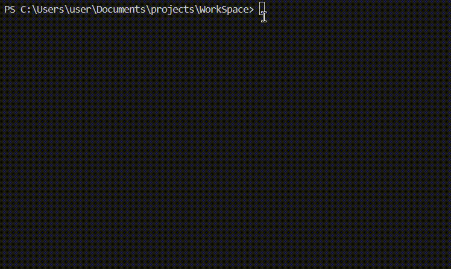

# Судоку на C

Это программа для игры в Судоку на языке C, предназначенная для Windows. Игра поддерживает два режима решения: **ручной** и **автоматический** (с использованием брутфорса). Данная версия игры работает с уже сгенерированным полем (генерация игровых полей легко встраивается).

## Возможности

- **Два размера поля**: 4x4 и 9x9.
- **Ручной режим**: Решение головоломки вручную с проверкой на правильность после каждого хода.
- **Автоматический режим**: Решение головоломки с помощью брутфорса, с визуализацией шагов.
- **Выделение измененных клеток**: Пустые клетки, заполняемые пользователем или брутфорсом, выделяются зеленым цветом для наглядности.
- **Повтор игры**: После завершения игры предлагается сыграть снова с другими размерами или методами решения.

## Установка и запуск

1. **Клонируйте данный репозиторий или скопируйте файлы `sudoku.c` и `auto_solve.c` в свой локальный**

2. **Компиляция:**
   В командной строке выполните следующие команды:
   
   ```bash
   gcc sudoku.c -o sudoku
   ./sudoku
   ```

3. **Выбор размеров поля и метода решения:**
   - В начале игры выберите размерность поля (4x4 или 9x9).
   - Затем выберите метод решения: **ручной** или **автоматический**.
   
4. **Режимы:**
   - **Ручной режим**: Перемещайте курсор по полю с помощью клавиш WASD и заполняйте клетки, пока решение не станет правильным.
      - Перед использованием не забудьте сменить раскладку клавиатуры на английскую.
      - Пока не решите головоломку правильно, будет выводиться сообщение `Wrong solution!`, как только решите – будет выведено `Great Solution!`.
   - **Автоматический режим**: Игра будет автоматически решать головоломку с визуализацией процесса.
      - После ее успешного решения будет выведено `Solution found!`.

5. **После решения**: После того как головоломка решена (вручную или автоматически), программа предложит сыграть Вам еще раз или выйти.

## Примечания

- Текущая версия проекта предназначена для работы только в ОС Windows.
- Для использования программы нужно иметь компилятор C, поддерживающий стандартный ввод/вывод и работу с цветами в консоли (например, MinGW).

## Пример работы


